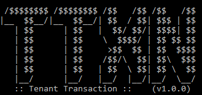

<b>Tenant Transaction</b> is an almost zero-configuration and lightweight plugin for spring framework that allows to change the tenant that will be used in any transaction/queries dynamically. It still keep all the features of spring's @Transactional annotation

# Quickstart

First of all, the tenant transaction is build on top of AspectJ, so we need to allow them:
```Java
    @Configuration
    @EnableAspectJAutoProxy
    public class AspectConfig {
    }
```
After that, we have to expose the TenantTransactionAOP bean with the strategy that your project need:
```Java
    @Configuration
    public class TenantTransactionConfiguration {

        @PersistenceContext
        private EntityManager entityManager;
        
        private final String defaultSchema;
        
        public TenantTransactionConfiguration(@Value("${myapp-default-schema}") final String defaultSchema){
            this.defaultSchema = defaultSchema;
        }

        @Bean
        public TenantTransactionAOP getAop(){

            final TenantTransactionHandler ttxnHandler = new PostgresqlChangeSchemaTtxnHandler(this.entityManager);
            return new TenantTransactionAOP(ttxnHandler, this.defaultSchema);
        }

    }
```
# Usage
Similar to using @Transactional, we need to annotate the transactional method with @TenantTransaction and additionally, mark @TenantWrapperIdentifier which parameter contains the tenant to be used
```Java
    @Repository
    public class SomeRepository {
        
        @TenantTransaction
        public void persist(final @TenantWrapperIdentifier TenantWrapper tenantIdentifier, final Entity entity) {
           // do persist
        }

    }
```
# Strategies

* ``PostgresqlChangeSchemaTtxnHandler`` the <a href="https://www.postgresql.org/">Postgresql</a> supports multiple schemas in the same database, and this strategy take advantage of this feature and switch between schemas to execut the commands in database

* ``MysqlChangeDatabaseTtxnHandler`` the <a href="https://www.mysql.com/">Mysql</a> treats the database and schema as one, so, in this strategy the handler make a switch between databases to execut the commands